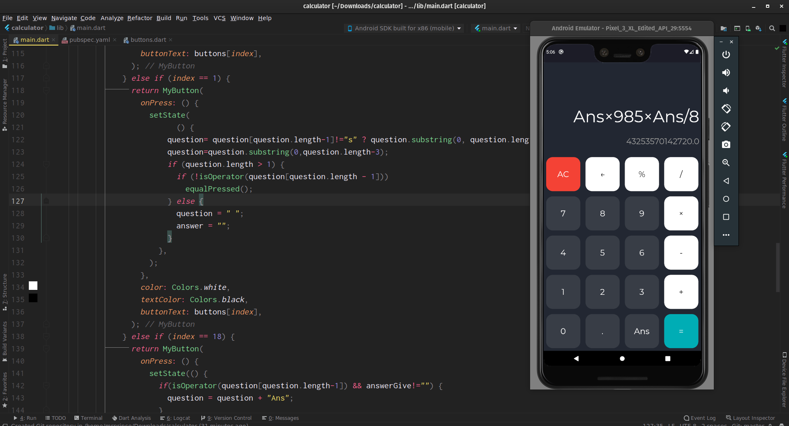

# Flutter Calculator

 ## Interactive Calculator with beautiful UI
 

## Remembers Previous Answers and Allows User to Perform Operations On Them

I learnt about implementation of functions and classes in Dart.

It is a wonderful language with all the nice parts from other languages.

Flutter makes App development fun.

### Download Android Arm64 app from [here](https://rb.gy/tprobu).
